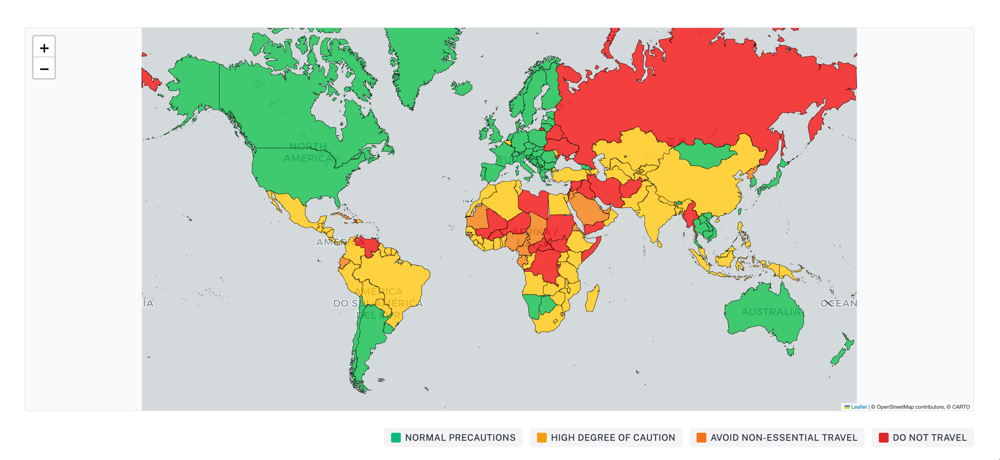

# Irish Travel Advice Map

An interactive world map visualizing official travel advisories from Ireland's Department of Foreign Affairs (DFA).

## Data sources

- Travel advisory data via [Ireland Department of Foreign Affairs](https://www.ireland.ie/en/dfa/overseas-travel/advice/)
- Country boundaries via [geo-countries GeoJSON dataset](https://github.com/datasets/geo-countries)
- French territory boundaries via [france-geojson](https://github.com/gregoiredavid/france-geojson)

## Live map

[See here for the live interactive map](https://travelmap.ie)

## Data collection

`travel_advice.py` is a Playwright script that scrapes travel advisory data from the DFA website. The script:

1. Visits the [DFA travel advice landing page](https://www.ireland.ie/en/dfa/overseas-travel/advice/)
2. Extracts all country/territory links using CSS selectors
3. Visits each country's advice page and scrapes the warning level from the `.accordion_travel` class
4. Outputs a timestamped JSON file (e.g., `2026-04-04.json`) with country slugs and advisory levels

## Questions/issues

Open a GitHub issue
